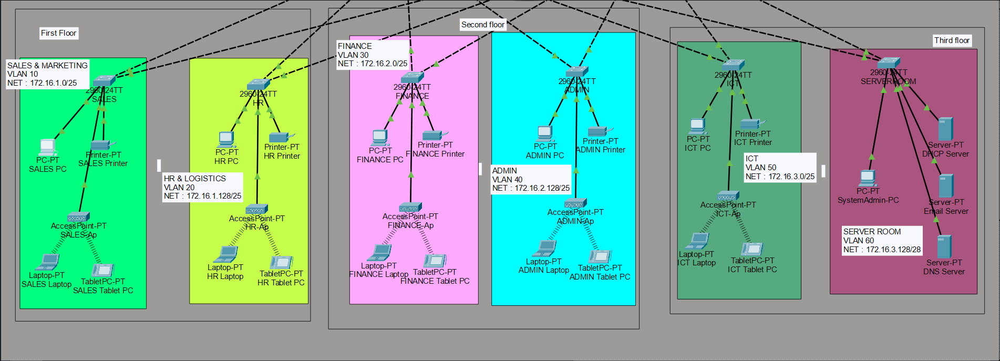
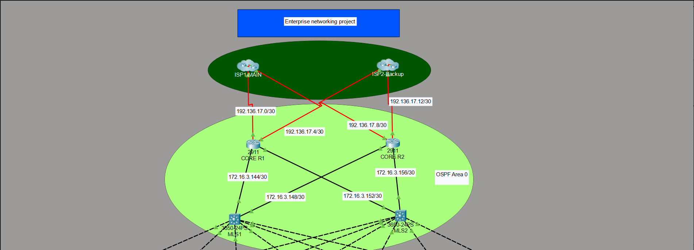

# Enterprise Network Design using Cisco Packet Tracer

## Overview

This project presents the design and implementation of an enterprise network for a three-floor support center with approximately 600 users.

The network was designed following the hierarchical model while ensuring redundancy, scalability, and secure communication.

## Features

- Hierarchical Network Design
- Dual ISP Redundancy
- Dual Core Routers
- Dual Multilayer Switches
- VLAN Segmentation
- Inter-VLAN Routing (SVI)
- OSPF Dynamic Routing
- DHCP
- SSH Remote Access
- Port Security
- Wireless Networks

## Network Topology

### Floor Layout

### Core Network (Routers & Switches)

## Files

- Enterprise_Network.pkt
- Network-Topology.png
- Documentation.pdf

## Tools Used

- Cisco Packet Tracer
- Cisco IOS
